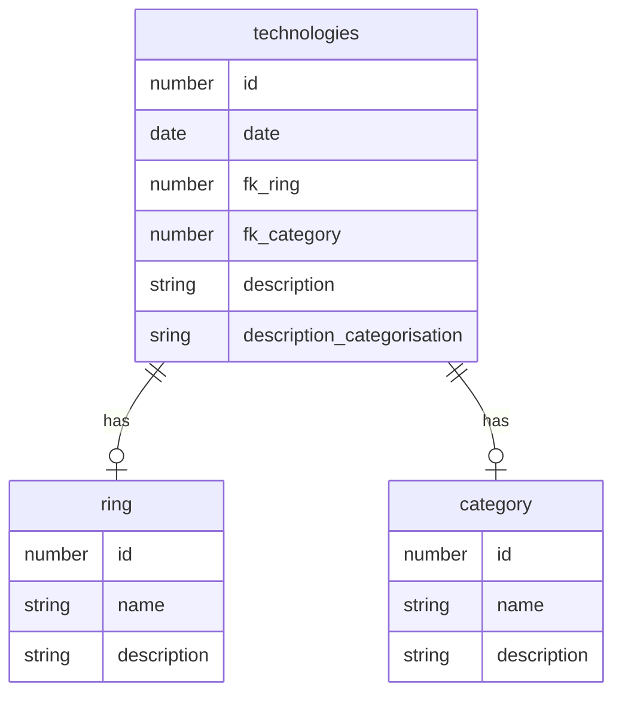

# Techradar

Der Techradar ist ein Projekt der HSLU für das Modul I.BA_WEBLAB. Als Grundlage für die Aufgabenstellung dient der [Projektbeschrieb](https://github.com/web-programming-lab/web-programming-lab-projekt/blob/main/Technologie-Radar.md), welcher auf Github öffentlich einsehbar ist.

## Features

- Technologie erfassen
- Technologie entwerfen und später publizieren
- Technologie ändern
- Technologie-Einordnung ändern
- Technologien anzeigen
## API Reference

#### Get all technologies

```http
  GET /api/technologies
```

| Parameter | Type     | Description                |
| :-------- | :------- | :------------------------- |
| `api_key` | `string` | **Required**. Your API key |

#### Get item

```http
  GET /api/technologies/${id}
```

| Parameter | Type     | Description                       |
| :-------- | :------- | :-------------------------------- |
| `id`      | `string` | **Required**. Id to fetch item    |

#### Get item

```http
  POST /api/technologies/
```

| Parameter | Type     | Description                       |
| :-------- | :------- | :-------------------------------- |
|           | `json`   | **Required**. Json to safe item   |

#### Update item

```http
  PATCH /api/technologies/${id}
```

| Parameter | Type     | Description                       |
| :-------- | :------- | :-------------------------------- |
| `id`      | `json`   | **Required**. Json to update item |


## Datenbankschema


## Technologiestack
- Angular
- MongoDB

## Authors
- [@flawas](https://www.github.com/flawas)

