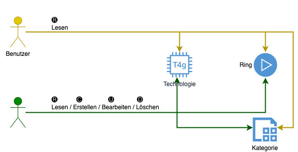
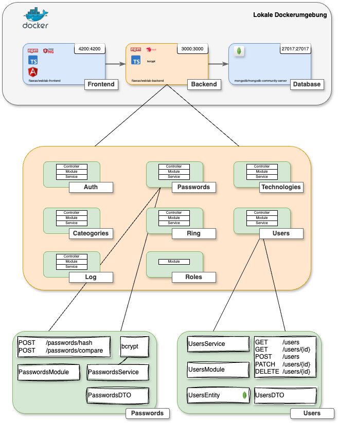
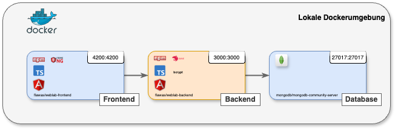
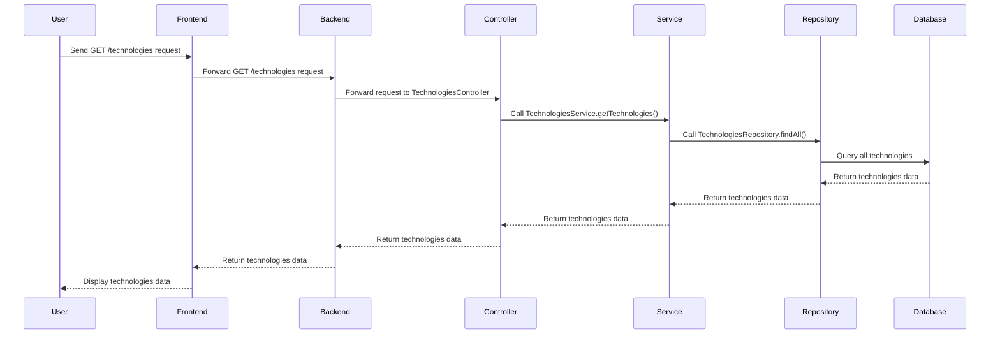

# Techradar Dokumentation
# Einführung und Ziele

Der Technologie-Radar ist ein passendes Werkzeug für Technologie-Management in einem Unternehmen, für ein Produkte-Team oder auch für sich als Software Architekt oder Software Engineer. Es gibt bereits verschiedene Umsetzungen von Technologie-Radare. Das prominenteste Beispiel ist der Technology Radar von ThoughtWorks.

Dabei werden die einzelnen Technologien jeweils in sogenannten vier Quadranten eingeordnet (Kategorien wie z.B. Techniques, Tools, Platforms, Languages & Frameworks). Die Maturität wird über sogn. Ringe eingestuft (Assess, Trial, Adopt, Hold).

## Aufgabenstellung
Als Software-Anbieter möchten Sie den Technologie-Radar als Software as a Service anbieten. Der Technologie-Radar besteht aus zwei elementaren Teilen:

* einer Technologie-Radar-Administration, in welcher die Technologien vom CTO oder einm Tech-Lead verwaltet werden können
* einem Technologie-Radar-Viewer, auf welcher der Technologie-Radar resp. die Technologien allen Mitarbeiter eingesehen werden können.

Optionaler Teil (nicht Teil der Aufgabenstellung):

* einer System-Administration, in welche neue Unternehmen resp. Mandanten erfasst und Personen eingeladen werden können.


## Qualitätsziele

Das Projekt hat in der Aufgebenstellung drei Qualitätsziele definiert:
* Der Technologie-Radar-Viewer soll neben der Desktop-Ansicht, auch für die Mobile-Ansicht optimiert sein.
* Der Technologie-Radar-Viewer soll innert 1s geladen sein.
* Sämtliche Anmeldungen an die Technologie-Radar-Administration werden aufgezeichnet.

# Randbedingungen
In der Gestaltung (UI) ist der Techradar frei umzusetzen. Die Darstellung der Techniken kann mittels eines Kreises, Quadranten oder Tabelle erfolgen.

Die einzige Bedingung ist die Verwendung von JavaScript für die Frontend- und Backendentwicklung.

# Kontextabgrenzung

Die Benutzer können im Grundsatz alles lesen. Ausgenommen davon sind Technologien, die noch nicht veröffentlicht sind. Diese Technologien sind nur für Administratoren sichtbar. Administratoren können alle Technologien lesen und bearbeiten. Weiter kann der Administrator Ringe und Kategorien erfassen. 




Im Techradar gibt es zwei Benutzerrollen:
* Benutzer (user)
* Adminstator (admin)

> [!NOTE]  
> Aktuell können Benutzerrollen nur in der Datenbank vergeben werden. Ein neuer Benutzer hat Standardmässig die Benutzer-Rolle zugeteilt. Ein Administrator kann die Benutzer-Rolle in der Datenbank auf Administrator ändern.

### Frontend

Alle Eingaben der Benutzer und Benutzer und Administratoren erfolgen über das Frontend. Das Frontend leitet die Befehle an das Backend weiter. Das Backend verarbeitet die Befehle und speichert die Daten in der Datenbank. Die Entscheidung, ob ein Benutzer genügend Rechte hat, um eine Aktion auszuführen, wird im Backend entschieden.

### Backend

Im Backend erfolgen alle Aufrufe mittels REST. Die Aufrufe wurden wo sinnvoll, nach CRUD (Create, Read, Update, Delete) gestaltet. Das Backend enthält jegliche Logik und Schnittstellen zur Datenbank.

## Fachlicher Kontext 

Die Daten werden mittels DTOs zwischen dem Frontend und dem Backend hin und her gegeben. Die DTOs sind in der Datenbank gespeichert. Die DTOs werden im Backend in Entities umgewandelt und in der Datenbank gespeichert. Die DTOs werden im Frontend entsprechend umgewandelt und dargestellt.


Die Kommunikation zwischen Frontend und Backend erfolgt mittels REST. Die REST-Aufrufe werden im Backend verarbeitet und in der Datenbank gespeichert. Die REST-Aufrufe werden im Frontend entsprechend verarbeitet und dargestellt.

## Technischer Kontext 

### Frontend
Das Frontend enthält keine veröffentlichten Schnittstellen. Der Benutzer kann lediglich mit dem GUI mit dem System interagieren. 

### Backend

Das Backend wird über REST-Schnittstellen bedient. Um die Wartbarkeit zu Erhöhgen, wurde der Standard von OpenAPI verwendet. 

# Lösungsstrategie
Das System wurde in drei Teile unterteilt. Dies umfasst folgende Teile:

* Datenbank
* Backend
* Frontend

Als Datenbank wird eine MongoDB-Datenbank verwendet. Diese kann in einem Docker-Container oder lokal betrieben werden.

Das Backend und Frontend wird in je seperaten Docker Containern betrieben und basiert auf [NPM](https://www.npmjs.com) und [TypeScript](https://www.typescriptlang.org). Das Backend ist in [NestJS](https://nestjs.com) geschrieben. Die Entscheidung für das Backend ist auf NestJS gefallen, da das Framework viele Integrationen besitzt. Dazu gehören Integrationen wie Authentifizierung, OpenAPI und rollenbasierter Zugriff. Das Frontend basiert auf einem Template von [PrimeNG](https://primeng.org). Bei PrimeNG handelt es sich um eine UI-Suite für Angular.

Die Idee der Dockerisierung kam schon relativ zu Beginn auf. Der Hintergedanke ist dabei die einfache Bereitstellung des Systems. Durch die Dockerisierung kann das System einfach auf einem Server bereitgestellt werden. Dabei ist es egal, ob es sich um einen Server in der Cloud oder lokal handelt.

Die Entscheidung für TypeScript ist auf die Typsicherheit zurückzuführen. TypeScript ist eine Erweiterung von JavaScript und bietet die Möglichkeit, Typen zu definieren. Dies erleichtert die Entwicklung und verhindert Fehler.

Die Entscheidung für MongoDB ist auf die Flexibilität zurückzuführen. MongoDB ist eine NoSQL-Datenbank und speichert Daten in Dokumenten. Dies ermöglicht eine flexible Speicherung von Daten. Dabei ist es egal, ob die Datenstruktur sich ändert. MongoDB ist in der Lage, die Daten flexibel zu speichern.

Die Entscheidung für NestJS ist auf die Integrationen zurückzuführen. NestJS bietet viele Integrationen, die die Entwicklung erleichtern. Dazu gehören Authentifizierung, OpenAPI und rollenbasierter Zugriff. Diese Integrationen sind für das System notwendig.

Die Entscheidung für PrimeNG ist auf die UI-Komponenten zurückzuführen. PrimeNG bietet viele UI-Komponenten, die die Entwicklung erleichtern. Dazu gehören Tabellen, Formulare und Dialoge. Diese Komponenten sind für das System notwendig.

Die Entscheidung für NPM ist auf die Paketverwaltung zurückzuführen. NPM ist der Paketmanager für JavaScript und bietet viele Pakete. Diese Pakete können einfach in das System integriert werden.

# Bausteinsicht

Das Gesamtsystem kann in drei Teile unterteilt werden. Dabei handelt es sich um drei verschiedene Container. Es werden folgende Container benötigt, um das System zu verwenden:
* Datenbank (MongoDB)
* Backend (NestJS)
* Frontend (Angular)



In der Bausteinsicht wird ersichtlich, dass die einzelnen Backend-Services grundlegend immer aus demselben Aufbau bestehen. Ein Service hat immer eine Controller-Klasse, eine Service-Klasse und eine DTO-Klasse. Die DTO-Klasse(n) wird(en) verwendet, um Daten zwischen dem Frontend und Backend auszutauschen. Die Service-Klasse enthält die Logik des Services. Die Controller-Klasse enthält die REST-Endpunkte des Services.

Die einzelnen Services enthalten zum Teil auch Tools von Dritten. Der PasswortService verwendet [bcrypt](https://www.npmjs.com/package/bcrypt), eine Standard-Library, um Passwörter zu hashen. Der AuthService verwendet [jsonwebtoken](https://www.npmjs.com/package/jsonwebtoken), um Tokens zu erstellen und zu validieren.

Die Services sind möglichst in sich gekapselt und verwenden nur die notwendigen Abhängigkeiten. Dadurch wird die Wartbarkeit und Erweiterbarkeit des Systems gewährleistet. Die Services sind so aufgebaut, dass sie einfach erweitert werden können. Dazu gehören die Erweiterung von REST-Endpunkten oder die Erweiterung von Logik.

## Gesamtsystem



Das Gesamtsystem wird in drei Teile unterteilt. Dabei handelt es sich um drei verschiedene Container. Es werden folgende Container benötigt, um das System zu verwenden. Die einzelnen Container sind im öffentlichen Docker Hub verfügbar.

| `Containername` | `Docker Hub`                              | `Beschreibung`  |
|:----------------|:------------------------------------------|:----------------|
| `Datenbank`     | `mongodb/mongodb-community-server:latest` | `Datenbank`     |
| `Backend`       | `flawas/weblab-backend:latest`            | `Backend`       |
| `Frontend`      | `flawas/weblab-frontend:latest`           | `Frontend`      |


Die Zerlegung in Frontend und Backend macht Sinn, da die beiden Teile unabhängig voneinander entwickelt werden können. Das Frontend kann unabhängig vom Backend entwickelt werden. Das Backend kann unabhängig vom Frontend entwickelt werden. Dadurch wird die Entwicklung beschleunigt und die Wartbarkeit erhöht. Es ermöglicht zudem auch die Austauschbarkeit der beiden Teile. Das Frontend kann beispielsweise einfach durch ein anderes Frontend ersetzt werden. 


### Wichtige Schnittstellen Backend

#### Kategorien
````
* GET /technologies
````
| Parameter | Type      | Description    |
  |:----------|:----------|:---------------|
| `request` | `request` | **Required**.  |
````
* GET /technologies/{id}
````
| Parameter | Type      | Description                                       |
|:----------|:----------|:--------------------------------------------------|
| `request` | `request` | **Required**.                                     |
| `id`      | `string`  | **Required**. The id of the requested technology. |

````
* POST /technologies
````
| Parameter               | Type            | Description                                   |
|:------------------------|:----------------|:----------------------------------------------|
| `request`               | `request`       | **Required**.                                 |
| `CreateTechnologiesDTO` | `string`        | **Required**. The DTO to create a technology. |
````
* PATCH /technologies/{id}
````
| Parameter               | Type            | Description                                   |
|:------------------------|:----------------|:----------------------------------------------|
| `request`               | `request`       | **Required**.                                 |
| `UpdateTechnologiesDTO` | `string`        | **Required**. The DTO to update a technology. |
````
* DELETE /technologies/{id}
````
| Parameter        | Type      | Description                                       |
|:-----------------|:----------|:--------------------------------------------------|
| `request`        | `request` | **Required**.                                     |
| `technologiesID` | `string`  | **Required**. The id of the technology to delete. |

##### DTOs
CreateTechnologiesDTO:
```
{
  "name": "string",
  "fk_ring": "string",
  "fk_category": "string",
  "description": "string",
  "description_categorisation": "string",
  "published": true
}
```

UpdateTechnologiesDTO:
```
{
  "name": "string",
  "fk_ring": "string",
  "fk_category": "string",
  "description": "string",
  "description_categorisation": "string",
  "published": true
}
```
#### Ringe
````
* GET /rings
````
| Parameter | Type      | Description    |
|:----------|:----------|:---------------|
| `request` | `request` | **Required**.  |
````
* GET /rings/{id}
````
| Parameter | Type      | Description                                 |
|:----------|:----------|:--------------------------------------------|
| `request` | `request` | **Required**.                               |
| `id`      | `string`  | **Required**. The id of the requested ring. |
````
* POST /rings
````
| Parameter       | Type            | Description                             |
|:----------------|:----------------|:----------------------------------------|
| `request`       | `request`       | **Required**.                           |
| `CreateRingDTO` | `string`        | **Required**. The DTO to create a ring. |
````
* PATCH /rings/{id}
````
| Parameter       | Type            | Description                             |
|:----------------|:----------------|:----------------------------------------|
| `request`       | `request`       | **Required**.                           |
| `UpdateRingDTO` | `string`        | **Required**. The DTO to update a ring. |
````
* DELETE /rings/{id}
````
| Parameter | Type      | Description                                 |
|:----------|:----------|:--------------------------------------------|
| `request` | `request` | **Required**.                               |
| `ringsID` | `string`  | **Required**. The id of the ring to delete. |

##### DTOs
CreateRingDto:
````
{
  "name": "string",
  "description": "string",
  "level": 0
}
````
> [!NOTE]  
> Das Level darf maximal einmal vorhanden sein. Es braucht eine Einmaligkeit, um die Sortierung zu gewährleisten! Dies wird im Backendservice geprüft.

UpdateRingDto:
````
{
  "name": "string",
  "description": "string",
  "level": 0
}
````
> [!NOTE]  
> Das Level darf maximal einmal vorhanden sein. Es braucht eine Einmaligkeit, um die Sortierung zu gewährleisten! Dies wird im Backendservice geprüft.

#### Kategorien
````
* GET /categories
````
| Parameter | Type      | Description    |
|:----------|:----------|:---------------|
| `request` | `request` | **Required**.  |
````
* GET /categories/{id}
````
| Parameter | Type      | Description                                     |
|:----------|:----------|:------------------------------------------------|
| `request` | `request` | **Required**.                                   |
| `id`      | `string`  | **Required**. The id of the requested category. |
````
* POST /categories
````
| Parameter           | Type            | Description                                 |
|:--------------------|:----------------|:--------------------------------------------|
| `request`           | `request`       | **Required**.                               |
| `CreateCategoryDTO` | `string`        | **Required**. The DTO to create a category. |
````
* PATCH /categories/{id}
````
| Parameter           | Type            | Description                                 |
|:--------------------|:----------------|:--------------------------------------------|
| `request`           | `request`       | **Required**.                               |
| `UpdateCategoryDTO` | `string`        | **Required**. The DTO to update a category. |
````
* DELETE /categories/{id}
````
| Parameter    | Type      | Description                                     |
|:-------------|:----------|:------------------------------------------------|
| `request`    | `request` | **Required**.                                   |
| `categoryId` | `string`  | **Required**. The id of the category to delete. |

##### DTOs
CreateCategoryDto:
````
{
  "name": "string",
  "description": "string"
}
````
UpdateCategoryDto:
````
{
  "name": "string",
  "description": "string"
}
````

#### Logs
`````
* GET /logs
`````
| Parameter | Type      | Description    |
|:----------|:----------|:---------------|
| `request` | `request` | **Required**.  |
`````
* GET /logs/public
`````
| Parameter | Type      | Description    |
|:----------|:----------|:---------------|
| `request` | `request` | **Required**.  |
`````
* POST /logs
`````
| Parameter      | Type            | Description                            |
|:---------------|:----------------|:---------------------------------------|
| `request`      | `request`       | **Required**.                          |
| `CreateLogDTO` | `string`        | **Required**. The DTO to create a log. |

##### DTOs
CreateLogDTO:
````
{
  "service": "Auth service",
  "severity": "debug",
  "description": "string",
  "public": true,
  "user": "string"
}
````
#### Authentifizierung
````
* POST /auth/login
````
| Parameter   | Type            | Description                                        |
|:------------|:----------------|:---------------------------------------------------|
| `request`   | `request`       | **Required**.                                      |
| `SignInDto` | `string`        | **Required**. The DTO to create a sign in request. |
````
* GET /auth/profile
````
| Parameter   | Type            | Description                                        |
|:------------|:----------------|:---------------------------------------------------|
| `request`   | `request`       | **Required**.                                      |

````
* GET /auth/validate-token
````
| Parameter   | Type            | Description                                        |
|:------------|:----------------|:---------------------------------------------------|
| `request`   | `request`       | **Required**.                                      |

##### DTOs
SignInDto:
`````
{
    "username": "MyUsername",
    "password": "MySecretPassword"
}
`````

#### Benutzer

````
* GET /users
````
| Parameter   | Type            | Description                                        |
|:------------|:----------------|:---------------------------------------------------|
| `request`   | `request`       | **Required**.                                      |

````
* GET /users/{username}
````
| Parameter   | Type            | Description                                        |
|:------------|:----------------|:---------------------------------------------------|
| `request`   | `request`       | **Required**.                                      |
| `username`  | `string`        | **Required**. The username of the requested user.  |

````
* POST /users
````
| Parameter       | Type         | Description                                   |
|:----------------|:-------------|:----------------------------------------------|
| `request`       | `request`    | **Required**.                                 |
| `CreateUserDTO` | `string`     | **Required**. The DTO to create a user.       |

````
* PATCH /users/{id}
````
| Parameter       | Type      | Description                              |
|:----------------|:----------|:-----------------------------------------|
| `request`       | `request` | **Required**.                            |
| `UpdateUserDTO` | `string`  | **Required**. The DTO to update a user.  |

`````
* DELETE /users/{id}
`````
| Parameter | Type      | Description                                 |
|:----------|:----------|:--------------------------------------------|
| `request` | `request` | **Required**.                               |
| `userId`  | `string`  | **Required**. The id of the user to delete. |

##### DTOs
CreateUserDTO:
````
{
  "username": "string",
  "password": "string",
  "mail": "user@example.com",
  "roles": [
    "user"
  ]
}
````

UpdateUserDto:
````
{
  "username": "string",
  "password": "string",
  "mail": "user@example.com",
  "roles": [
    "string"
  ]
}
````
#### Passwörter
````
* POST /passwords/hash
````
| Parameter            | Type      | Description                                      |
|:---------------------|:----------|:-------------------------------------------------|
| `request`            | `request` | **Required**.                                    |
| `CreatePasswordHash` | `string`  | **Required**. The DTO to create a password hash. |

````
* POST /passwords/compare
````
| Parameter             | Type      | Description                                       |
|:----------------------|:----------|:--------------------------------------------------|
| `request`             | `request` | **Required**.                                     |
| `ComparePasswordHash` | `string`  | **Required**. The DTO to compare a password hash. |

##### DTOs
CreatePasswordHash:
````
{
  "plainTextPassword": "string"
}
````

ComparePasswordHash:
````
{
  "plainTextPassword": "string",
  "hashedPassword": "string"
}
````

# Laufzeitsicht

Damit das System läuft, braucht es alle drei Container. Die Container haben somit eine Abhängigkeit voneinander. Das Frontend benötigt das Backend, um Daten anzuzeigen. Das Backend benötigt die Datenbank, um Daten zu speichern und zu lesen. Die Datenbank speichert die Daten und stellt sie dem Backend zur Verfügung.

Am  Einfachsten werden die Container mit einer `Docker-Compose.yml` Datei bereitgestellt. Das File kann wie folgt aussehen:

````
services:
  mongodb:
    image: mongodb/mongodb-community-server:latest
    container_name: mongodb
    ports:
      - "27017:27017"
    volumes:
      - mongo-data:/data/db

  backend:
    image: flawas/weblab-backend:latest
    container_name: weblab-backend
    ports:
      - "3000:3000"
    depends_on:
      - mongodb
    environment:
      MONGO_URL: mongodb://mongodb:27017/techradardb

  frontend:
    image: flawas/weblab-frontend:latest
    container_name: weblab-frontend
    ports:
      - "4200:4200"
    depends_on:
      - backend
````
> [!NOTE]  
> Um die Daten persistent zu speichern, sollte die `Docker-Compose.yml` Datei so angepasst werden, dass die Datenbank in einem Volume gespeichert wird.

> [!NOTE]  
> Um die Ausfallsicherheit zu erhöhen kann in der `Docker-Compose.yml` Datei ein Neustart des Containers im Fehlerfall eingefügt werden.

## Laufzeitsicht Technologie anzeigen

Die Laufzeitsicht "Technologie anzeigen" zeigt auf, was es alles braucht, um eine Technologie anzuzeigen. Dabei wird aufgezeigt, wie die Daten von der Datenbank über das Backend ins Frontend gelangen.

> [!NOTE]  
> Das Authentifizierung und Autorisierung wird in dieser Laufzeitsicht nicht berücksichtigt.



## Laufzeitsicht Login 

Beim Login wird ersichtlich, dass der Benutzername und das Passwort an den Backend-Service übergeben werden. Der Service prüft, ob die Daten korrekt sind. Ist dies der Fall, wird ein Token erstellt und zurückgegeben. Der Token wird im Frontend gespeichert und bei jedem weiteren Request mitgesendet. Somit muss der Benutzer sich nicht bei jedem Request erneut anmelden.

```mermaid

````mermaid
sequenceDiagram
    participant User
    participant Frontend
    participant Backend
    participant AuthController
    participant AuthService
    participant UsersService
    participant PasswordsService
    participant LogService
    participant JwtService

    User->>Frontend: Send POST /auth/login request
    Frontend->>Backend: Forward POST /auth/login request
    Backend->>AuthController: Forward request to AuthController
    AuthController->>AuthService: Call AuthService.signIn()
    AuthService->>UsersService: Call UsersService.findOneByUsername()
    UsersService-->>AuthService: Return user data
    AuthService->>PasswordsService: Call PasswordsService.compare()
    PasswordsService-->>AuthService: Return comparison result
    AuthService->>LogService: Call LogService.create() with login success log
    LogService-->>AuthService: Log created
    AuthService->>JwtService: Call JwtService.signAsync()
    JwtService-->>AuthService: Return JWT token
    AuthService-->>AuthController: Return JWT token
    AuthController-->>Backend: Return JWT token
    Backend-->>Frontend: Return JWT token
    Frontend-->>User: Display JWT token
````

# Verteilungssicht

Die Verteilungssicht zeigt nochmals auf, dass es am Einfachsten ist, alle Container auf einem Docker-Host bereitzustellen. Es besteht aber die Möglichkeit, die einzelnen Container verteilt auf mehreren Hosts zu betreiben. Dabei ist es wichtig, dass die Container miteinander kommunizieren können.

````mermaid
graph TD
    subgraph Docker Host
        subgraph MongoDB Container
            Mongodb[(MongoDB)]
        end
        subgraph Backend Container
            Backend[(NestJS Backend)]
        end
        subgraph Frontend Container
            Frontend[(Angular Frontend)]
        end
    end

    Mongodb <--> Backend
    Backend <--> Frontend
    User --> Frontend
````

# Querschnittliche Konzepte

## Data Transfer Object (DTO)
Das DTO (Data Transfer Object) Muster wird verwendet, um Daten zwischen verschiedenen Schichten einer Anwendung zu übertragen. Es dient dazu, Daten in einer strukturierten Form zu kapseln und zu transportieren, ohne dass die zugrunde liegende Geschäftslogik oder Datenbankstruktur offengelegt wird.  
Vorteile des DTO-Musters:
* Kapselung: DTOs kapseln die Daten und verhindern, dass die interne Struktur der Datenbank oder Geschäftslogik offengelegt wird.
* Reduzierung der Datenmenge: DTOs können nur die benötigten Daten enthalten, was die Menge der übertragenen Daten reduziert.
* Trennung der Schichten: DTOs ermöglichen eine klare Trennung zwischen den verschiedenen Schichten der Anwendung (z.B. Präsentationsschicht, Geschäftsschicht, Datenzugriffsschicht).

## HTTP
Das HTTP-Muster bezieht sich auf die Verwendung des Hypertext Transfer Protocol (HTTP) zur Kommunikation zwischen Client und Server in Webanwendungen. Es umfasst verschiedene Methoden, Statuscodes und Header, die zur Steuerung des Datenflusses und zur Definition der Interaktionen verwendet werden.  
HTTP-Methoden
* GET: Ruft Daten vom Server ab. Wird verwendet, um Ressourcen zu lesen.
* POST: Sendet Daten an den Server, um eine neue Ressource zu erstellen.
* PUT: Aktualisiert eine bestehende Ressource vollständig.
* PATCH: Aktualisiert eine bestehende Ressource teilweise.
* DELETE: Löscht eine Ressource vom Server.
HTTP-Statuscodes
* 200 OK: Die Anfrage war erfolgreich.
* 201 Created: Eine neue Ressource wurde erfolgreich erstellt.
* 400 Bad Request: Die Anfrage war fehlerhaft.
* 401 Unauthorized: Authentifizierung ist erforderlich.
* 403 Forbidden: Zugriff auf die Ressource ist verboten.
* 404 Not Found: Die angeforderte Ressource wurde nicht gefunden.
* 500 Internal Server Error: Ein Serverfehler ist aufgetreten.

HTTP-Header
* Content-Type: Gibt den Medientyp der Ressource an (z.B. application/json).
* Authorization: Enthält Anmeldeinformationen zur Authentifizierung.

### Beispiel
Ein Beispiel für eine HTTP-Interaktion könnte ein Login-Prozess sein:
#### Anfrage (Request)
````
POST /auth/login HTTP/1.1
Host: example.com
Content-Type: application/json

{
  "username": "testuser",
  "password": "testpassword"
}
````

#### Antwort (Response)
````
HTTP/1.1 200 OK
Content-Type: application/json

{
  "access_token": "eyJhbGciOiJIUzI1NiIsInR5cCI6IkpXVCJ9..."
}
````

## CRUD
CRUD stands for Create, Read, Update, and Delete. These are the four basic operations that can be performed on data in a database or a persistent storage system. Each operation corresponds to a specific HTTP method when working with RESTful APIs.

### CRUD-Operations
Create: Adds a new record to the database.  
* HTTP Method: POST
* Example: Creating a new user.
````
POST /users
Content-Type: application/json

{
  "username": "newuser",
  "password": "password123",
  "email": "newuser@example.com"
}
````
Read: Retrieves data from the database.  
* HTTP Method: GET
* Example: Fetching a list of users.
````
GET /users
````

Update: Modifies an existing record in the database.
* HTTP Method: PUT or PATCH
* Example: Updating a user's email.
````
PATCH /users/1
Content-Type: application/json

{
  "email": "updateduser@example.com"
}
````
Delete: Removes a record from the database.
* HTTP Method: DELETE
* Example: Deleting a user.
````
DELETE /users/1
````

# Architekturentscheidungen {#section-design-decisions}

::: formalpara-title
**Inhalt**
:::

Wichtige, teure, große oder riskante Architektur- oder
Entwurfsentscheidungen inklusive der jeweiligen Begründungen. Mit
\"Entscheidungen\" meinen wir hier die Auswahl einer von mehreren
Alternativen unter vorgegebenen Kriterien.

Wägen Sie ab, inwiefern Sie Entscheidungen hier zentral beschreiben,
oder wo eine lokale Beschreibung (z.B. in der Whitebox-Sicht von
Bausteinen) sinnvoller ist. Vermeiden Sie Redundanz. Verweisen Sie evtl.
auf Abschnitt 4, wo schon grundlegende strategische Entscheidungen
beschrieben wurden.

::: formalpara-title
**Motivation**
:::

Stakeholder des Systems sollten wichtige Entscheidungen verstehen und
nachvollziehen können.

::: formalpara-title
**Form**
:::

Verschiedene Möglichkeiten:

-   ADR ([Documenting Architecture
    Decisions](https://cognitect.com/blog/2011/11/15/documenting-architecture-decisions))
    für jede wichtige Entscheidung

-   Liste oder Tabelle, nach Wichtigkeit und Tragweite der
    Entscheidungen geordnet

-   ausführlicher in Form einzelner Unterkapitel je Entscheidung

Siehe [Architekturentscheidungen](https://docs.arc42.org/section-9/) in
der arc42 Dokumentation (auf Englisch!). Dort finden Sie Links und
Beispiele zum Thema ADR.

# Qualitätsanforderungen {#section-quality-scenarios}

::: formalpara-title
**Inhalt**
:::

Dieser Abschnitt enthält möglichst alle Qualitätsanforderungen als
Qualitätsbaum mit Szenarien. Die wichtigsten davon haben Sie bereits in
Abschnitt 1.2 (Qualitätsziele) hervorgehoben.

Nehmen Sie hier auch Qualitätsanforderungen geringerer Priorität auf,
deren Nichteinhaltung oder -erreichung geringe Risiken birgt.

::: formalpara-title
**Motivation**
:::

Weil Qualitätsanforderungen die Architekturentscheidungen oft maßgeblich
beeinflussen, sollten Sie die für Ihre Stakeholder relevanten
Qualitätsanforderungen kennen, möglichst konkret und operationalisiert.

::: formalpara-title
**Weiterführende Informationen**
:::

Siehe [Qualitätsanforderungen](https://docs.arc42.org/section-10/) in
der online-Dokumentation (auf Englisch!).

## Qualitätsbaum
1. Performance: Der Technologie-Radar-Viewer soll innert 1s geladen sein.
2. Usability: Der Technologie-Radar-Viewer soll neben der Desktop-Ansicht auch für die Mobile-Ansicht optimiert sein.
3. Security: Sämtliche Anmeldungen an die Technologie-Radar-Administration werden aufgezeichnet.

````mermaid
graph TD
    Qualität
    Qualität --> Performance
    Performance --> "Viewer soll innert 1s geladen sein"
    Qualität --> Usability
    Usability --> "Viewer soll für Mobile-Ansicht optimiert sein"
    Qualität --> Security
    Security --> "Anmeldungen an Administration werden aufgezeichnet"
````

## Qualitätsszenarien
hre Qualitätsszenarien sind konkrete Beschreibungen, wie das System auf bestimmte Auslöser reagieren soll. Basierend auf den Qualitätszielen in Ihrem Projekt sind die Qualitätsszenarien wie folgt:
Nutzungsszenarien
1. Performance:  
* Szenario: Ein Benutzer öffnet den Technologie-Radar-Viewer.
* Erwartung: Der Technologie-Radar-Viewer wird innerhalb von 1 Sekunde geladen.
2. Usability:  
* Szenario: Ein Benutzer öffnet den Technologie-Radar-Viewer auf einem mobilen Gerät.
* Erwartung: Der Technologie-Radar-Viewer ist für die Mobile-Ansicht optimiert und benutzerfreundlich.
3. Security:  
* Szenario: Ein Benutzer meldet sich an der Technologie-Radar-Administration an.
* Erwartung: Die Anmeldung wird aufgezeichnet und in den Logs gespeichert.

Änderungsszenarien
1. Performance:  
* Szenario: Die Anzahl der Technologien im Radar wird verdoppelt.
* Erwartung: Der Technologie-Radar-Viewer wird weiterhin innerhalb von 1 Sekunde geladen.
2. Usability:  
* Szenario: Eine neue Funktionalität wird hinzugefügt, die eine zusätzliche Benutzerinteraktion erfordert.
* Erwartung: Die Benutzerfreundlichkeit bleibt erhalten, und die neue Funktionalität ist sowohl auf Desktop- als auch auf mobilen Geräten leicht zugänglich.
3. Security:
* Szenario: Ein Sicherheitsupdate wird implementiert.
* Erwartung: Alle Anmeldungen und sicherheitsrelevanten Aktionen werden weiterhin korrekt aufgezeichnet und überwacht.

# Risiken und technische Schulden

## Risiken
Das ganze Konstrukt läuft gut, jedoch sollte man beachten, dass dieses nicht direkt ins Internet gehängt werden sollte. Es müssen zwingend Verbesserungen in der Sicherheit erleidgt werden, bevor ein solches System über das Internet erreichbar ist. Beispielsweise sollte die Authentifizierung und Autorisierung verbessert werden.

## Technische Schulden
### Testing
Das Testing wurde lediglich auf Backend-Ebene teilweise gemacht. Dies hat dem zeitlichen Aspekt zu schulden. Die Tests wurden in Postman integriert und sind öffentlich abrufbar: 

[](https://app.getpostman.com/run-collection/1f

Das Frontend wurde nicht getestet, da die Zeit fehlte. Es wurde jedoch darauf geachtet, dass das Frontend so einfach wie möglich gehalten wurde. Dadurch sollte die Fehleranfälligkeit minimiert werden.